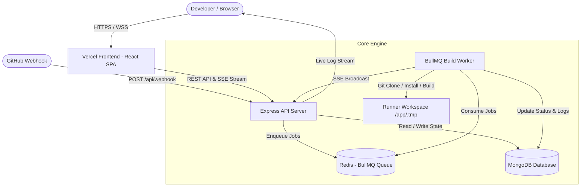

# 🚀 Mini CI/CD Pipeline

<p align="center">
  
  
  
  
  
  
  
  
</p>

A modern, production-grade, lightweight CI/CD platform engineered with **React (Vite)**, **Node.js/Express**, **BullMQ/Redis**, and **MongoDB**. Supports automated multi-stage pipelines (`clone` → `install` → `build` → `test` → `deploy`), dynamic `.ci.yml` configurations, real-time Server-Sent Events (SSE) log streaming, encrypted secrets management (AES-256-GCM), GitHub webhook triggers with HMAC verification, team collaboration with RBAC, and distributed job execution.

---

## 🌐 Live Production Deployments

- **🖥️ Web Dashboard (Vercel):** [https://mini-cicd.vercel.app](https://mini-cicd.vercel.app)
- **⚙️ Backend API & Worker (Render):** [https://mini-cicd.onrender.com](https://mini-cicd.onrender.com)
- **🩺 API Health Check:** [https://mini-cicd.onrender.com/api/health](https://mini-cicd.onrender.com/api/health)

---

## ✨ Key Features

- **⚡ End-to-End Multi-Stage Pipeline:**
  - Automated 5-stage lifecycle: **`clone`** → **`install`** → **`build`** → **`test`** → **`deploy`**.
  - Real-time step duration tracking and visual progress badges with live status indicators.
- **📡 Real-Time SSE Log Streaming:**
  - Zero-delay log broadcasting to the browser using Server-Sent Events (`EventSource`).
  - Dual storage: live terminal stream + persistent log retention in MongoDB.
- **📄 Dynamic Pipeline Engine (`.ci.yml`):**
  - Define custom pipeline stages and arbitrary shell commands in a repository root `.ci.yml` file.
  - Automatic fallback to intelligent multi-language runners (Node.js & Python).
- **🐍 Multi-Language Runner Support:**
  - **Node.js:** Automatic detection of `package.json`, `npm ci`/`npm install` with `--legacy-peer-deps` resilience, `npm run build`, and `npm test`.
  - **Python:** Automatic detection of `requirements.txt`/`pyproject.toml`, isolated `pip` dependency resolution, and `pytest` discovery.
  - **Static / Generic:** Graceful pass-through for repositories without build manifests.
- **👥 Workspaces, Projects & RBAC:**
  - Multi-tenant project management.
  - Role-Based Access Control (**`OWNER`**, **`ADMIN`**, **`DEVELOPER`**, **`VIEWER`**).
- **🔐 Secret Management & API Keys:**
  - AES-256-GCM encrypted project environment variables & secrets.
  - Granular API key issuance with SHA-256 hashing and instant revocation.
- **🛡️ Secure GitHub Webhooks:**
  - Automatic build triggering on GitHub `push` events.
  - Timing-safe HMAC SHA-256 (`X-Hub-Signature-256`) payload verification.
- **🧹 Self-Healing & Process Resilience:**
  - Automatic orphaned build recovery upon startup (`queued`/`running` $\rightarrow$ `failed`).
  - Graceful process termination with `SIGTERM`/`SIGINT` handling and temporary workspace cleanup.
- **📊 Metrics & Analytics:**
  - Real-time success rates, average build runtimes, failure trends, and project activity audit logs.

---

## 🏗️ Architecture



---

## 🚀 Quick Start (Local Development)

### Prerequisites
- [Node.js 20+](https://nodejs.org/)
- [Docker & Docker Compose](https://www.docker.com/)
- [Git](https://git-scm.com/)

### 1. Clone the Repository
```bash
git clone https://github.com/Arjun-coder-ops/mini-cicd.git
cd mini-cicd
```

### 2. Run with Docker Compose (Recommended)
Launch the complete stack (Frontend, API, Worker, MongoDB, Redis) in one command:

```bash
docker compose up -d --build
```

- **Frontend:** [http://localhost](http://localhost) (Port 80)
- **API Server:** [http://localhost:3000](http://localhost:3000) (Port 3000)
- **MongoDB:** `localhost:27017`
- **Redis:** `localhost:6379`

### 3. Run Manually (Without Docker)

#### Backend:
```bash
cd server
cp ../.env.example .env
npm install
npm run dev
```

#### Frontend:
```bash
cd client
npm install
npm run dev
```

Frontend will run at `http://localhost:5174` and connect to backend at `http://localhost:4000`.

---

## ⚙️ Environment Variables Reference

Create a `.env` file in the root and `/server` directories with the following configuration:

| Variable | Required | Default | Description |
| :--- | :---: | :---: | :--- |
| `PORT` | No | `4000` | Port for Express API server |
| `NODE_ENV` | No | `development` | Environment mode (`development` / `production`) |
| `MONGODB_URI` | **Yes** | `mongodb://127.0.0.1:27017/mini-cicd` | MongoDB connection string (local or MongoDB Atlas) |
| `REDIS_URL` | **Yes** | `redis://127.0.0.1:6379` | Redis connection URL for BullMQ job queue |
| `CLIENT_URL` | No | `http://localhost:5174` | Allowed frontend origin for CORS |
| `JWT_SECRET` | **Yes** | `random-secret` | Secret key for signing JSON Web Tokens |
| `REFRESH_TOKEN_SECRET` | **Yes** | `random-secret` | Secret key for JWT refresh tokens |
| `ENCRYPTION_KEY` | **Yes** | 32-byte hex key | 64-char hex key used for AES-256-GCM secret encryption |
| `ALLOWED_REPOS` | No | `*` | Comma-separated `owner/repo` list, or `*` to allow all repos |
| `GITHUB_SECRET` | No | `""` | Secret key configured in GitHub Webhook settings |
| `WEBHOOK_VERIFICATION_ENABLED` | No | `true` | Enforces HMAC SHA-256 signature verification |
| `API_AUTH_TOKEN` | No | `""` | Static API Bearer token for automated bot requests |
| `MAX_CONCURRENT_BUILDS` | No | `2` | Maximum simultaneous worker pipeline runs |
| `STEP_TIMEOUT_MS` | No | `300000` (5 min) | Maximum timeout per pipeline step in milliseconds |
| `PIPELINE_TIMEOUT_MS` | No | `1200000` (20 min) | Maximum overall pipeline execution timeout |
| `BUILDS_DIR` | No | `.tmp/cicd-builds` | Local scratch directory for repo clones and logs |
| `GITHUB_TOKEN` | No | `""` | Optional GitHub PAT for cloning private repositories |

---

## 📄 Custom Pipeline Configuration (`.ci.yml`)

Add a `.ci.yml` file to the root of your repository to override default stages with custom commands:

```yaml
# Example: Full Stack Pipeline
pipeline:
  lint:
    command: npm run lint
  install:
    command: npm ci
  build:
    command: npm run build
  test:
    command: npm test -- --coverage
  deploy:
    environment: production
    command: echo "Deploying to production server..."
```

---

## 🔌 API Endpoints Summary

### Authentication
- `POST /api/auth/register` — Create a new user account
- `POST /api/auth/login` — Authenticate and receive JWT tokens
- `POST /api/auth/refresh` — Refresh access token
- `GET  /api/auth/me` — Get authenticated user profile

### Projects
- `GET    /api/projects` — List user's accessible projects
- `POST   /api/projects` — Create a new project workspace
- `GET    /api/projects/:id` — Get project details & statistics
- `PATCH  /api/projects/:id` — Update project settings
- `DELETE /api/projects/:id` — Delete project workspace
- `GET    /api/projects/:id/members` — List team members
- `POST   /api/projects/:id/members` — Add member with assigned role

### Builds & Pipeline
- `GET  /api/builds?projectId=:id` — List builds for a project (paginated)
- `POST /api/builds/trigger` — Trigger a manual pipeline build
- `GET  /api/builds/:id` — Retrieve build status and step breakdown
- `GET  /api/builds/:id/logs` — Retrieve full logs for a build
- `GET  /api/builds/:id/stream` — Real-time SSE stream of live logs
- `POST /api/builds/:id/cancel` — Cancel an in-progress pipeline
- `POST /api/builds/:id/retry` — Retry a previous build

### Webhooks & Health
- `POST /api/webhook` — GitHub push webhook receiver (HMAC verified)
- `GET  /api/health` — Service health & database connectivity check

---

## 🔗 GitHub Webhook Configuration

1. In your GitHub repository, navigate to **Settings** $\rightarrow$ **Webhooks** $\rightarrow$ **Add webhook**.
2. **Payload URL:** `https://mini-cicd.onrender.com/api/webhook` (or your domain).
3. **Content type:** `application/json`.
4. **Secret:** Set to the value of `GITHUB_SECRET` in your `.env`.
5. **Events:** Select **Just the `push` event**.
6. Click **Add webhook**. Future commits pushed to your repository will automatically trigger CI/CD builds!

---

## 🧪 Testing & Code Quality

```bash
# Run server test suites
cd server && npm test

# Run client production build
cd client && npm run build

# Run security vulnerability audit
cd server && npm audit --omit=dev
cd client && npm audit --omit=dev
```

---

## 🛡️ Security Best Practices

- **Timing-Safe HMAC:** Webhooks validate GitHub's `X-Hub-Signature-256` using `crypto.timingSafeEqual` against the raw, unparsed request buffer.
- **AES-256-GCM Encryption:** Project secrets and environment variables are encrypted at rest using authenticating ciphertext with initialization vectors (IV) and authentication tags.
- **Strict Git Ownership:** Docker containers enforce `safe.directory '*'` and non-root execution permissions (`node:node`).
- **Resource Limits:** Automatic timeouts kill runaway processes after 5 minutes per step or 20 minutes total.

---

## 📜 License

Distributed under the **MIT License**. See `LICENSE` for details.
